# 钟于钢琴工作室 · 架构白皮书（根 README）

> 本文档是项目总入口：完整说明项目架构、设计理念、关键数据流、风险控制与演进路线。  
> 服务端部署与接口细节详见 [`server/README.md`](server/README.md)。

---

## 目录

1. [项目定位与问题定义](#1-项目定位与问题定义)
2. [总体架构（Local-first 双轨）](#2-总体架构local-first-双轨)
3. [核心流程时序（登录、备份、老板查看）](#3-核心流程时序登录备份老板查看)
4. [模块分层与依赖地图](#4-模块分层与依赖地图)
5. [设计理念与工程取舍](#5-设计理念与工程取舍)
6. [风险控制与可恢复机制](#6-风险控制与可恢复机制)
7. [近期功能迭代与实现链路（V7）](#7-近期功能迭代与实现链路v7)
8. [项目演进里程碑与未来路线](#8-项目演进里程碑与未来路线)
9. [开发与排障导航](#9-开发与排障导航)
10. [本地开发与发布](#10-本地开发与发布)

---

## 1. 项目定位与问题定义

本项目是面向钢琴工作室的微信小程序，核心不是“做一个日历”，而是解决三类真实经营问题：

- **排课效率**：老师在弱网/碎片时间也能快速完成排课、改课、复制、顺延。
- **结算一致性**：课时费、分成、年度汇总、工作室支出口径要前后一致、可复核。
- **多角色治理**：老板可跨老师查看经营快照，但权限边界明确，不误改老师课表。

对应仓库主模块：

- 前端业务：[`miniprogram/pages`](miniprogram/pages)
- 前端核心能力：[`miniprogram/utils`](miniprogram/utils)
- 服务端（可选）：[`server/index.js`](server/index.js)

---

## 2. 总体架构（Local-first 双轨）

### 2.1 架构总览图（图 1/8）

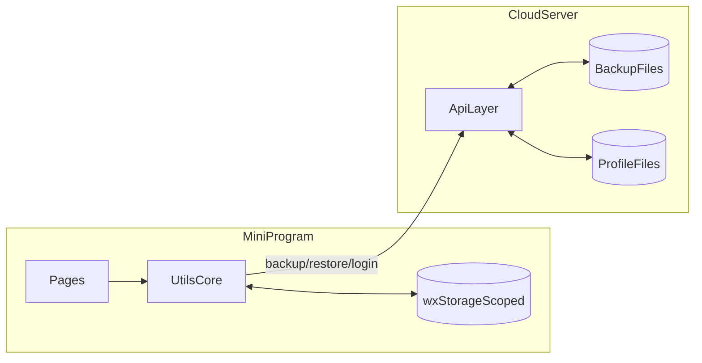

### 2.2 设计含义

- **本地权威**：排课写入先落本地 `storage`，用户体验不依赖实时网络。
- **云端快照**：服务端保存 append-only 备份文件，负责跨设备恢复与老板聚合读取。
- **职责分离**：业务计算主要在前端纯函数完成，服务端聚焦鉴权、落盘、聚合。

---

## 3. 核心流程时序（登录、备份、老板查看）

### 3.1 登录与 token 链路（图 2/8）

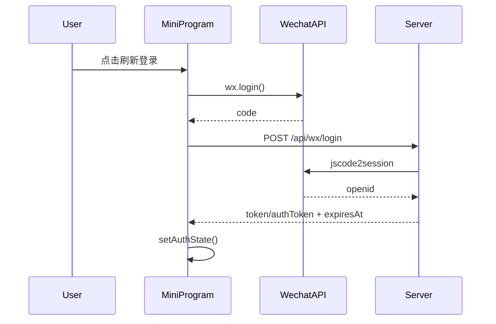

关键代码：

- [`miniprogram/utils/auth.ts`](miniprogram/utils/auth.ts)
- [`miniprogram/pages/settings/settings.ts`](miniprogram/pages/settings/settings.ts)
- [`server/index.js`](server/index.js)

### 3.2 备份与补偿状态机（图 3/8）

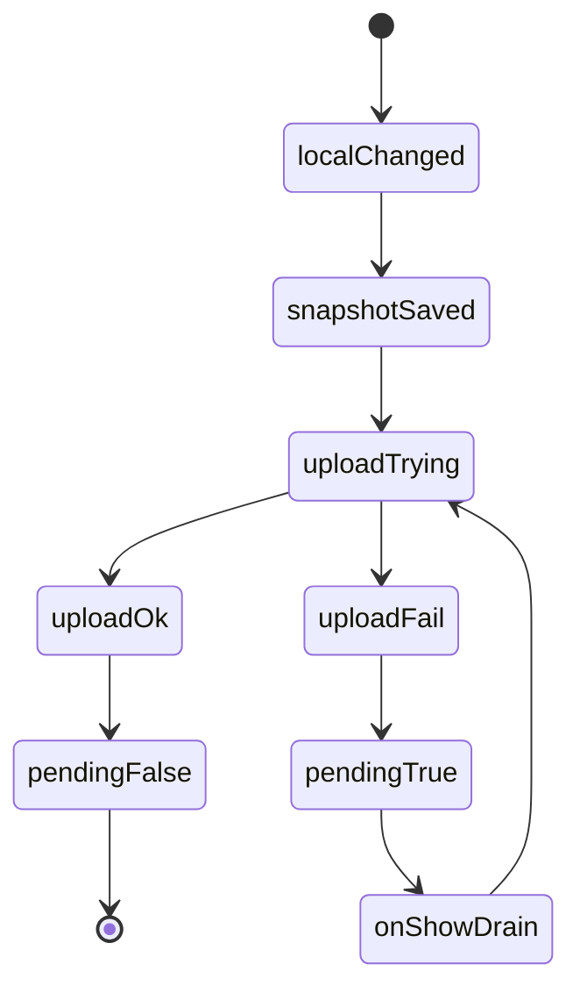

关键代码：

- [`miniprogram/utils/cloud.ts`](miniprogram/utils/cloud.ts)
- [`miniprogram/app.ts`](miniprogram/app.ts)

### 3.3 老板视图与权限边界（图 4/8）

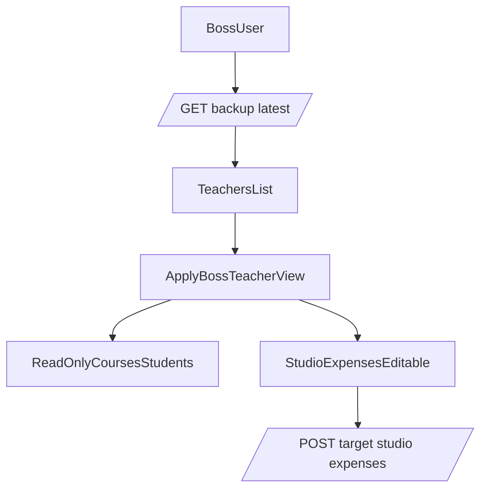

关键代码：

- [`miniprogram/utils/bossSwitch.ts`](miniprogram/utils/bossSwitch.ts)
- [`miniprogram/pages/boss/boss-teachers/boss-teachers.ts`](miniprogram/pages/boss/boss-teachers/boss-teachers.ts)
- [`server/index.js`](server/index.js)

### 3.4 支出字段兼容语义（图 5/8）

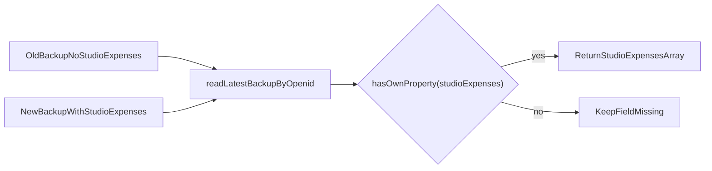

这张图对应的策略是：**缺键不等于空数组**，避免旧备份语义被错误覆盖。

---

## 4. 模块分层与依赖地图

### 4.1 前端分层

- **页面层**：`index/week/day/course-edit/stats/year-summary/settings/...`
- **业务能力层（utils）**：
  - 存储：`storage.ts`
  - 鉴权：`auth.ts`
  - 云同步：`cloud.ts`
  - 老板切换：`bossSwitch.ts`
  - 排课算法：`schedule.ts`
  - 统计计算：`feeStats.ts` + `yearSummaryCompute.ts`
- **类型层**：`types/index.ts`

### 4.2 依赖关系图（图 6/8）

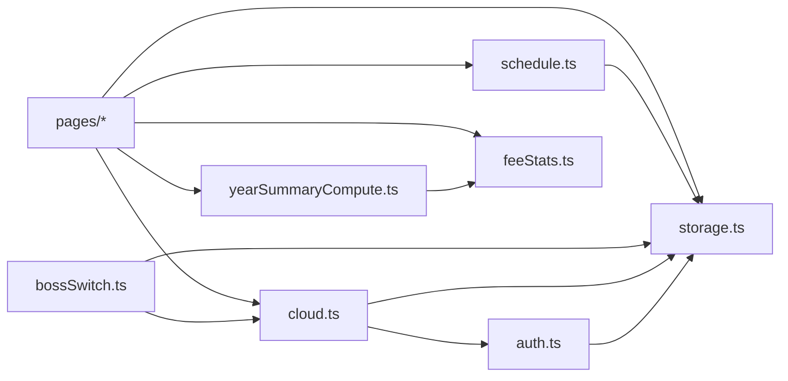

### 4.3 统计同源口径图（图 7/8）

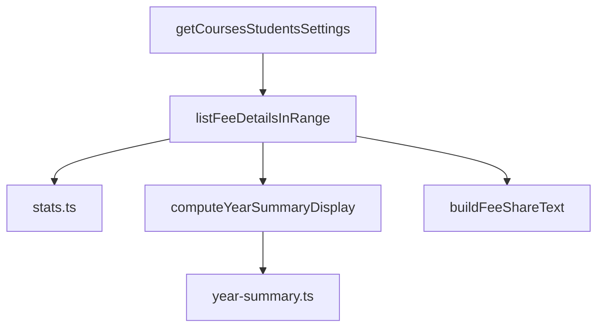

含义：统计页、年度汇总、分享文案共享同一计算核心，避免口径分叉。

---

## 5. 设计理念与工程取舍

### 5.1 Local-first：先保证老师“能用”，再谈同步

- 老师排课是高频操作，网络不是随时稳定，因此本地写入优先。
- 云端备份是“保护资产”和“跨设备恢复”，不是实时写库。
- 实际收益：弱网不阻断业务，减少“保存失败导致停摆”。

### 5.2 兼容优先：让存量版本可继续使用

- `token/authToken` 双字段兼容。
- `expiresAt=0` 和正数时间戳都可解释。
- `studioExpenses` 采用缺键兼容语义，避免旧备份被误判；并在写入侧增加**空值防覆盖**（见 7.1），避免老师全量备份把老板代填支出清空。
- URL 规范化兼容反向代理与历史资源地址。

### 5.3 权限最小化：老板可治理，不可越权

- 老板聚合读取全员 latest。
- 老板代看他人时，课程/学生默认只读。
- 仅工作室支出支持专用接口写入目标老师快照。

### 5.4 算法同源：保证“显示、分享、汇总”一致

- 费用计算统一在 `feeStats`。
- 年度汇总统一在 `yearSummaryCompute`。
- 金额每步 `round2`，降低浮点累计误差。

---

## 6. 风险控制与可恢复机制

### 6.1 风险闭环图（图 8/8）

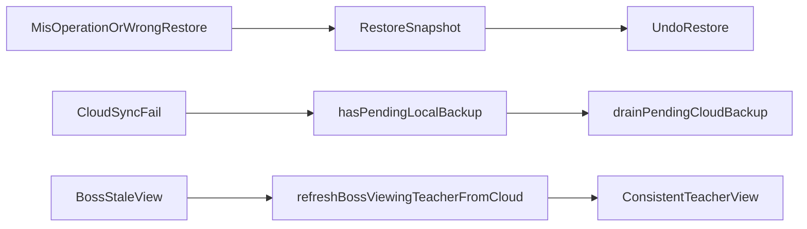

### 6.2 关键风险与对策

- **误覆盖风险**：刷新登录强制二选一（上传本地 / 恢复云端）。
- **同步失败风险**：pending 标记 + onShow 补偿重试。
- **并发续登风险**：单飞 token 刷新，避免互相覆盖状态。
- **老板视图陈旧风险**：节流刷新 + 下拉强制刷新。
- **口径漂移风险**：统计与汇总核心函数复用。

---

## 7. 近期功能迭代与实现链路（V7）

> 本章聚焦最新一轮迭代的**问题背景 → 数据流 → 关键代码**，便于评审快速理解“为什么这样改”。

### 7.1 工作室支出「防覆盖」修复（服务端）

**问题现象**：老板在「查看老师」时填好的工作室支出，过一段时间再进去追加时消失了；年度汇总里的「工作室」支出也随之变空。

**根因**：老板代填走 `POST /api/backup/target-studio-expenses`，当时确实写入了含支出的备份；但老师端日常操作（改课、加学生、打开小程序）会触发 `POST /api/backup` 全量备份，请求体总携带本机 `studioExpenses`（老师本机通常为空 `[]`）。服务端只认每个老师目录下 **mtime 最新** 的备份文件，于是老师那份「空支出」成为最新版，把老板代填的支出覆盖掉。

**修复链路（图 9）**：

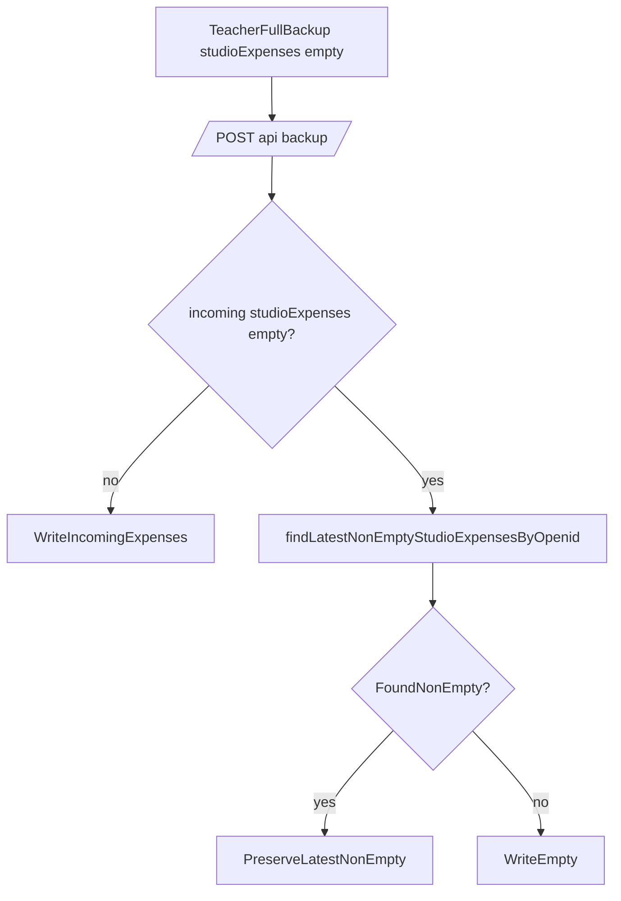

**关键代码**：

- [`server/index.js`](server/index.js)
  - `findLatestNonEmptyStudioExpensesByOpenid()`：按 mtime 由新到旧回溯历史备份，取最近一份非空支出。
  - `POST /api/backup`：写入前若 `studioExpenses` 为空则用回溯结果兜底，而非直接写 `[]`。

**边界**：仅“只增不减”保护；真正清空支出应通过老板代管接口提交。已丢失的历史支出需从旧备份文件手工找回。

### 7.2 课程备注（note）

**需求背景**：临时给家长占位排课时先随便填个时间，正式排课时容易忘记原本约定的时段（如本应下午却排到上午）。希望能加个备注提醒自己。

**实现链路（图 10）**：

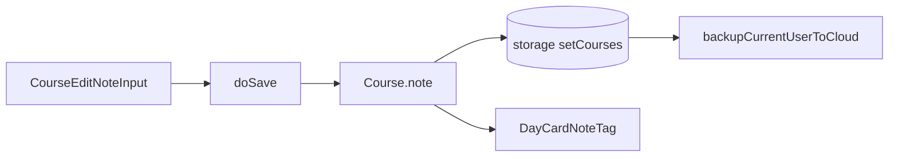

**关键代码**：

- [`miniprogram/types/index.ts`](miniprogram/types/index.ts)：复用既有 `Course.note` 字段，未改数据结构。
- [`miniprogram/pages/course-edit/course-edit.ts`](miniprogram/pages/course-edit/course-edit.ts)：新增 `onNoteInput`，`doSave` 在新增/编辑两条分支写入 `note`。
- [`miniprogram/pages/day/day.wxml`](miniprogram/pages/day/day.wxml)：课程卡片有备注时展示琥珀色「备注」标签。

**安全边界**：备注仅出现在编辑页与日视图；分享课表图（`schedule-image`）不含备注，确保“仅自己可见”，不泄露给家长。

### 7.3 分享图「上一日/下一日」切换 + 星期显示

**需求背景**：在「当日费用统计图」查看某天后，想看前一天/后一天需退回统计页重新选日期，操作繁琐。

**实现链路（图 11）**：

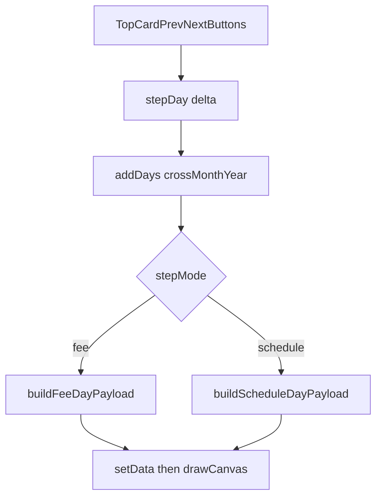

**关键代码**：

- [`miniprogram/pages/schedule-image/schedule-image.ts`](miniprogram/pages/schedule-image/schedule-image.ts)
  - `buildFeeDayPayload()` / `buildScheduleDayPayload()`：首屏与切换共用同一套计算，避免逻辑分叉。
  - `stepDay()` + `addDays()`：按 ±1 天重建并重绘，自动跨月跨年。
  - `weekdayCn()`：日期后统一显示中文星期（如「6月6日 周五」）。
- [`miniprogram/pages/schedule-image/schedule-image.wxml`](miniprogram/pages/schedule-image/schedule-image.wxml)：顶部卡片在按日模式改为「‹ 上一日 ｜ 标题 ｜ 下一日 ›」三段式布局。

**一致性**：当日费用图（`fee-day`）与当日课表图（`day`）共用同一组件与逻辑，交互与视觉完全一致；周/月/年费用图、年度汇总图不显示切换按钮，布局保持原样。

---

## 8. 项目演进里程碑与未来路线

### 8.1 已完成里程碑

- V1：本地排课闭环（课程/学生/设置）+ 冲突检测与顺延。
- V2：登录与云备份（append-only）。
- V3：老板模式（聚合查看、切换老师）。
- V4：工作室支出独立治理 + 老板代写目标支出。
- V5：登录冲突保护（手动二选一）+ 上传前快照回滚。
- V6：年度汇总、分享增强、时长自定义与按比例计费。
- V7：支出防覆盖修复 + 课程备注 + 分享图按日切换与星期显示（详见第 7 章）。

### 8.2 未来路线（非破坏式升级）

- **性能**：老板聚合从目录扫描升级索引/分页。
- **存储**：可平滑引入对象存储与增量同步。
- **安全**：更短期 token、刷新机制、可选端到端加密备份。
- **工程**：服务端从单文件渐进拆分，不破坏 API 契约。

---

## 9. 开发与排障导航

### 9.1 关键函数入口

- 登录与同步：
  - [`miniprogram/utils/auth.ts`](miniprogram/utils/auth.ts) `loginWithServer()`
  - [`miniprogram/utils/cloud.ts`](miniprogram/utils/cloud.ts) `backupCurrentUserToCloud()`
  - [`miniprogram/pages/settings/settings.ts`](miniprogram/pages/settings/settings.ts) `onLoginForBackup()`
- 老板模式：
  - [`miniprogram/utils/bossSwitch.ts`](miniprogram/utils/bossSwitch.ts) `applyBossTeacherView()`
  - [`miniprogram/pages/boss/boss-cert/boss-cert.ts`](miniprogram/pages/boss/boss-cert/boss-cert.ts) `performExitBossAuth()`
- 排课与统计：
  - [`miniprogram/utils/schedule.ts`](miniprogram/utils/schedule.ts) `autoShiftAfterUpdate()`
  - [`miniprogram/utils/feeStats.ts`](miniprogram/utils/feeStats.ts) `listFeeDetailsInRange()`
  - [`miniprogram/utils/yearSummaryCompute.ts`](miniprogram/utils/yearSummaryCompute.ts) `computeYearSummaryDisplay()`
- 服务端：
  - [`server/index.js`](server/index.js) `verifyAuthToken()`, `readLatestBackupByOpenid()`

### 9.2 常见排障顺序

1. 老师本地有数据但老板看不到：先查是否有新备份文件落盘。  
2. 备份失败：检查 token 是否有效，再看 pending 是否被 drain。  
3. 登录后数据异常：确认选择的是“上传本地”还是“恢复云端”。  
4. 年度数据不一致：核对是否共用 `feeStats/yearSummaryCompute` 路径。

---

## 10. 本地开发与发布

1. 用微信开发者工具打开项目，指定 `miniprogram` 为小程序根目录。  
2. 服务端部署与环境变量见 [`server/README.md`](server/README.md)。  
3. 配置合法域名（request/downloadFile）后进行联调。  
4. 发布前建议完成三类检查：
   - 登录与备份链路
   - 老板切换与只读边界
   - 统计与年度汇总口径一致性

---

## 附：仓库主路径

- 前端：[`miniprogram`](miniprogram)
- 服务端：[`server`](server)
- 类型声明：[`typings`](typings)

---

*本 README 随代码持续演进；如文档与实现冲突，以代码行为为准并及时回填文档。*
