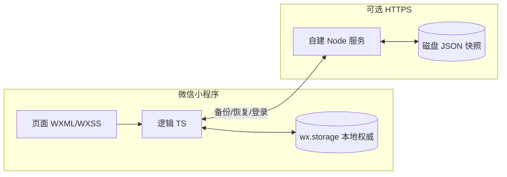

# 钟于钢琴工作室 · 微信小程序（Local-first 教学管理）

> **定位**：面向钢琴（音乐）工作室的 **排课、计费、统计与多端备份** 一体化小程序。前端以 **本地存储为权威数据源**，弱网仍可排课；可选对接自建 Node 服务端完成 **微信登录、JSON 快照云备份、老板聚合视图、头像/背景托管**。本文档面向 **创业大赛 / 国赛答辩级** 阐述：**架构取舍、数据流、模块地图、设计思路与演进计划**。服务端部署与接口契约详见 **[`server/README.md`](server/README.md)**。

---

## 目录

1. [系统架构总览](#1-系统架构总览)
2. [核心功能矩阵](#2-核心功能矩阵)
3. [仓库与技术栈](#3-仓库与技术栈)
4. [目录结构（实际仓库）](#4-目录结构实际仓库)
5. [数据模型与存储键策略](#5-数据模型与存储键策略)
6. [关键模块说明（utils / 页面协作）](#6-关键模块说明utils--页面协作)
7. [云端同步与冲突处理（概要）](#7-云端同步与冲突处理概要)
8. [老板模式与客户价值](#8-老板模式与客户价值)
9. [交互与体验（UI/动效）](#9-交互与体验ui动效)
10. [设计思路（约 3000 字）](#10-设计思路约-3000-字)
11. [设计重点与难点（约 1000 字）](#11-设计重点与难点约-1000-字)
12. [项目研究进度与计划（500 字内）](#12-项目研究进度与计划500-字内)
13. [本地开发与发布](#13-本地开发与发布)

---

## 1. 系统架构总览



- **离线优先**：课程、学生、定价、工作室支出等业务写入 **先落本地**，网络可用时再异步调用 `utils/cloud.ts` 上传快照。
- **服务端角色**：不是实时 CRUD 数据库，而是 **append-only 备份文件 + 登录鉴权 + 静态资源**（详见服务端 README）。
- **多端现实**：同一工作室可能存在多名老师与一名负责人；「老板模式」在客户端切换视图并通过云端快照对齐。

---

## 2. 核心功能矩阵

| 模块 | 说明 | 主要路径 |
|------|------|----------|
| 月 / 周 / 日视图 | 日历标记、周轨时间片、某日课程列表与添加 | `pages/index`、`week`、`day` |
| 课程编辑 | 学生、时段、**自定义时长（分钟）**、按比例计费 | `pages/course-edit` |
| 学生 | 名单维护、与排课联动 | `pages/students` |
| 统计 | 区间课时费、分成思路展示、**年度汇总区块** | `pages/stats`、`stats/student-courses` |
| 工作室支出 | 按月记录支出，参与年度核算（口径见业务设置） | `pages/studio-expenses` |
| 年度汇总 | 独立页 + 统计页底部汇总，支持分享文案 / 生成图 | `pages/year-summary`、`stats` |
| 偏好 / 单价 | 默认时长、提醒、学生偏好定价等 | `pages/preferences`、`student-pricing` |
| 个人 / 登录 / 备份 | 微信登录、刷新登录 **二选一同步**、备份中心、账户详情 | `pages/settings`、`backup-center` |
| 老板模式 | 认证、老师列表、切换视图只读课表、可代管工作室支出 | `pages/boss/*` |
| 分享 | 月视图分享文本、**文本逆向导入当月课程** | `pages/index` |
| 关于 | 版本与说明 | `pages/about` |

---

## 3. 仓库与技术栈

| 层级 | 技术 |
|------|------|
| 小程序 | TypeScript、微信小程序原生框架、`glass-easel` 组件框架、`lazyCodeLoading: requiredComponents` |
| 样式 | 全局 `app.wxss` + 各页 `wxss`；毛玻璃、圆角、系统蓝；支持 `prefers-reduced-motion` 降级 |
| 本地持久化 | `wx.setStorageSync` / `getStorageSync`，键按用户/范围隔离（见 `utils/storage.ts`） |
| 服务端（可选） | Node.js 18+、Express、`server/index.js` |
| 类型 | `miniprogram/types/index.ts` 与 `typings` 下 wx 声明 |

---

## 4. 目录结构（实际仓库）

```
miniprogram-2/
├── README.md                 # 本文件（产品 + 客户端架构）
├── server/                   # Node 备份服务，详见 server/README.md
│   ├── index.js
│   └── README.md
├── miniprogram/
│   ├── app.ts / app.json / app.wxss
│   ├── types/index.ts      # Course、Student、AppSettings、StudioExpense 等
│   ├── components/         # app-background、ios-modal 等
│   ├── pages/              # 各业务页（index/week/day/course-edit/...）
│   └── utils/
│       ├── storage.ts      # 本地键、读写课程/学生/设置/支出/快照
│       ├── schedule.ts     # 顺延、冲突、时间换算
│       ├── feeStats.ts     # 课时费、分成、round2
│       ├── cloud.ts        # 登录后备份、拉取、老板相关云接口、待上传队列
│       ├── auth.ts         # Token 与登录态
│       ├── boss.ts / bossSwitch.ts  # 老板 UI 提示、视图切换与云端刷新
│       ├── yearSummaryCompute.ts / studioExpenseStats.ts
│       ├── server.ts / env.ts
│       └── ...
├── typings/                # 小程序 API 类型声明
├── tsconfig.json
└── project.config.json
```

---

## 5. 数据模型与存储键策略

- **核心类型**：见 `miniprogram/types/index.ts`（如 `Course` 含 `date`、`duration`、`studentName` 等；`StudioExpense` 含 `yearMonth`、`amount`）。
- **作用域**：登录用户 openid 变化或老板切换查看对象时，Storage 键应区分 **本人数据** 与 **老板代看缓存**，避免串数据（具体键名以 `storage.ts` 为准）。
- **恢复快照**：`RestoreSnapshot` 用于登录冲突处理与上传前回滚，包含 `courses`、`students`、`settings`、`studioExpenses`、`snapshotAt`。

---

## 6. 关键模块说明（utils / 页面协作）

| 模块 | 职责 |
|------|------|
| `storage.ts` | 统一读写本地数据；`getValidAuthToken` 相关存储；**上传前快照** 等安全语义 |
| `schedule.ts` | `autoShiftAfterUpdate` 顺延、`hasConflict` 冲突检测 |
| `feeStats.ts` | 按定价与时长比例计算费用，**金额 round2** 累加，避免浮点误差 |
| `cloud.ts` | `backupCurrentUserToCloud`、`fetchLatestBackupFromCloud`、`pushTargetStudioExpensesToCloud`；**待备份队列**、静默续登写路径等 |
| `auth.ts` | `loginWithServer`、`getValidAuthToken`（含 `expiresAt === 0` 永久兼容） |
| `bossSwitch.ts` | 切换老板查看目标、从云端刷新老师数据、合并 `studioExpenses` |
| `yearSummaryCompute.ts` | 年度汇总展示数据（与 stats / year-summary 共用） |
| `studioExpenseStats.ts` | 支出校验、按自然年汇总等 |

页面侧典型调用：**写操作**（编辑课程、改支出）先改 `storage`，再异步 `backupCurrentUserToCloud`；**读云端**在设置、备份中心、老板列表等入口触发。

### 6.1 代码阅读导航（先读这些函数）

- 登录与同步主链路：
  - `miniprogram/utils/auth.ts`: `loginWithServer()`, `getValidAuthToken()`
  - `miniprogram/utils/cloud.ts`: `backupCurrentUserToCloud()`, `drainPendingCloudBackup()`, `fetchBossTeachersFromCloud()`
  - `miniprogram/pages/settings/settings.ts`: `onLoginForBackup()`, `tryAutoRestoreAfterLogin()`
- 本地作用域与老板切换：
  - `miniprogram/utils/storage.ts`: `scopedKey()`, `getBossViewingTeacherInfo()`
  - `miniprogram/utils/bossSwitch.ts`: `applyBossTeacherView()`, `restorePersistedBossTeacherView()`
- 排课与统计口径：
  - `miniprogram/utils/schedule.ts`: `autoShiftAfterUpdate()`, `restoreShiftedFollowersAfterUpdate()`, `insertCourseAndShift()`
  - `miniprogram/pages/course-edit/course-edit.ts`: `trySave()`, `doSave()`
  - `miniprogram/utils/feeStats.ts`: `listFeeDetailsInRange()`
  - `miniprogram/utils/yearSummaryCompute.ts`: `computeYearSummaryDisplay()`

---

## 7. 云端同步与冲突处理（概要）

- **刷新登录**：用户显式选择 **「以上传本地为准」** 或 **「以云端恢复为准」**，避免误覆盖（实现见 `pages/settings/settings.ts`）。
- **静默续登**：用于刷新 Token 以便 **写入** 云端；不应与「恢复云端全量」混为一谈。
- **上传前快照**：任意云备份前写入 `RestoreSnapshot`，支持误操作后回滚（与设置页文案配合）。
- **老板查看老师**：老板端 `onShow` / 下拉刷新可节流拉取目标老师最新备份，缓解「老师本机已更新但老板仍看旧快照」的滞后。

---

## 8. 老板模式与客户价值

- **认证**：`pages/boss/boss-cert` 完成负责人身份；服务端以备份内 `settings.bossCertified === true` 为凭据配合接口。
- **老师列表**：`boss-teachers` 拉取云端聚合列表（失败时提示重新登录）。
- **权限**：查看其他老师课表/学生一般为只读；**工作室支出**可由负责人在专用页代写并同步至服务端 **目标老师快照**（与 `server` 的 `target-studio-expenses` 对应）。
- **价值**：小班教学机构无需购买重型 SaaS，即可实现「数据在自己服务器 + 本地极速编辑」的组合。

---

## 9. 交互与体验（UI/动效）

- **视觉**：iOS 风格毛玻璃、圆角卡片、系统蓝强调色；长列表页支持下拉刷新（见各页 `json` 与 `onPullDownRefresh`）。
- **动效**：全局过渡时长与缓动在 `app.wxss` 等文件中统一；尊重用户系统「减少动态效果」偏好。
- **无障碍与运维**：关键路径 Toast / Modal；分享年度汇总支持复制与生成图片（具体能力随微信 API 与页面实现）。

---

## 10. 设计思路（约 3000 字）

钢琴工作室的日常经营，表面上是在「排课」，实质上是在同时处理 **时间资源约束**、**师生匹配与沟通**、**现金流与分成预期** 三类问题。通用日历或备忘录只能解决第一类的一部分；通用表格又很难在手机上「站着就把下周课拖清楚」。本项目的产品与技术路线，是把场景收窄到 **小班工作室 + 微信生态 + 负责人需要汇总** 的典型路径，用 **本地优先的数据架构** 保证一线老师「打开就能改」，用 **可选自建服务端** 满足负责人「掌握全机构快照」而不绑定昂贵 SaaS。

**Local-first 不是「偷懒不做后端」，而是对真实网络环境与操作习惯的承认。** 教学场地往往在地下室或屏蔽较好的商场 Wi-Fi 边缘；老师也可能习惯先记在手机上再整理。若把权威放在云端，每一次保存都要等待往返，失败时还要解释「为什么保存不了」——这对小型工作室是不可接受的摩擦。因此客户端把 `wx.storage` 当作第一时间写入的目标：冲突检测、顺延、计费预览全部在本地完成，用户感知的是「立刻生效」。云端只在「备份成功」的时刻参与叙事，这就把系统从「实时协同编辑」重新定位为 **强一致本地 + 弱一致备份**，边界清晰，答辩时也好解释。

与之配套的是 **费用计算的确定性与可解释性**。课时费往往按「每 45 分钟单价」口径报价，但实际课程可能是 30、60、90 分钟或自定义分钟数。项目在 `feeStats.ts` 中采用「单价 / 基准时长 × 实际时长」，并对单次与累计 **保留两位小数**，避免 JavaScript 浮点误差在月度、年度汇总时被放大。设计上刻意不把复杂 SQL 放在服务端，而把规则集中在 TypeScript 纯函数里——单元测试与复盘时对账更容易，也更符合「工作室负责人用手机计算器也能 roughly 对上」的心理预期。

**微信登录与自建 Token** 解决的是「谁是备份文件的合法所有者」。小程序不提供传统账号密码，openid 由微信颁发；业务 Token 由自建服务使用 HMAC 签名，避免把 session_key 暴露在客户端逻辑里。客户端侧保存 `expiresAt` 与 Token，上传前检查有效性；过期则静默续登或引导用户走刷新登录。曾经出现过「短期 Token 导致老师长期本地使用却不再上传」的真实故障，这促使产品层把 **有效期拉长 + 兼容老版本正数时间戳 + 上传队列重试** 结合起来——技术文档里写「 Token 多久过期」很简单，难的是 **与海量存量客户端行为的兼容**，这才是创业与国赛评委关心的「工程成熟度」。

**老板模式** 反映的是组织架构：老师维护自己的课表与学生线索，负责人关心汇总与成本。若在服务端允许负责人任意 PATCH 老师的每一节课，责任边界会变得糊涂——谁的键盘改了这节课的时间？因此产品在交互上把「查看他人」设为强约束下的只读，把「工作室支出」这类天然属于机构账本的信息，单独拆成页面与专用同步接口，由服务端读取目标最新快照后 **仅替换支出数组** 再追加新备份文件。这样既保留 append-only 的可追溯性，又让权责划分说得清。客户端 `bossSwitch.ts` 负责在切换视图时替换本地缓存、节流刷新云端，避免老板端长期停留在过时快照。

**登录与同步冲突** 是 Local-first 产品一定会面对的「黑暗森林」。用户不一定理解「云端备份」与「本地草稿」的差别；一旦自动拉取覆盖本地，舆情灾难远大于技术灾难。因此「刷新登录」路径采用强制二选一：**上传本地** 或 **恢复云端**，并把上传前的本地状态写入恢复快照。这不是否定云端，而是承认 **手机才是老师此刻最信任的屏幕**。文档向评委陈述时，应强调这不是保守，而是 **数据伦理与口碑风险管理**。

**年度汇总、工作室支出、分成展示** 将分散课程抬升为经营视角：工作室支出只影响负责人一侧净收入口径（具体规则以实现为准），避免老师侧误解「被扣款」。分享能力（文本、图片）服务于微信群协作——工作室大量决策发生在微信聊天里，导出格式必须可读、可转发、可复盘。月视图「分享文本逆向导入」则是典型 **闭环设计**：分享不是单程广播，而是允许在授权二次确认的前提下把结构化课表还原回本地，减少重复录入。

**页面与导航结构** 也服务于「高频路径最短」：月视图作为首页降低记忆成本；周视图解决「连续几天同一学生的块状安排」；日视图承载时间片列表与顺延入口。设置、备份中心、关于分散在「个人」链路，避免把运维操作塞进排课主路径。统计与年度汇总拆页又合并入口（统计页底部与独立 `year-summary`），兼顾「随手看一眼」与「年底讲故事」两种动机。

**工程实现层面的自我约束** 包括：类型集中在 `types/index.ts`，避免魔法字符串扩散；云相关集中在 `cloud.ts`，避免每个页面各自拼 URL；老板相关集中在 `boss.ts` / `bossSwitch.ts`，避免权限判断散落。这样答辩时可以画出清晰的「模块 ownership」，而不是「每改一个需求就全仓库搜索 wx.request」。

组件层面，`app-background`、`ios-modal` 等减少重复样式与遮罩逻辑；`glass-easel` 与按需注入契合性能诉求。动画统一时长与尊重 `prefers-reduced-motion`，体现「好用」优先于「炫技」。从科研叙事角度，本项目的关键贡献不是发明新算法，而是把 **教学工作室的数据生命周期**（录入—汇总—备份—治理）映射成 **可交付、可运维、可道歉（回滚）** 的软件路径——这在创新创业评审里往往比「用了某某中间件」更有说服力。

最后补一句边界：**我们不是教务处的超级系统**，也不替代财务软件的凭证与税务合规；我们解决的是「小型工作室能不能用一部手机把课排清楚、把钱算清楚、把负责人看清楚」。综上，小程序侧的设计哲学可概括为：**以本地确定性支撑一线效率，以可选云端快照支撑机构治理，以清晰边界支撑责任划分，以兼容与回滚支撑真实世界的升级节奏**。

再把「时间表算法」单独拎出来讲清价值：`schedule.ts` 中的顺延不是炫酷动画，而是 **约束求解的退化情形**——在同一物理教室或同一老师链条上，修改一节课的起点可能牵动后续多节课。选择在客户端即时完成，是为了让老师立刻看到「会不会撞车」，而不是提交后再返回错误。冲突检测 `hasConflict` 与顺延组合，本质上是在维护 **时间轴上的不变量**：同一学生在极端情况下也可能多重约束，产品上要优先保证「可解释」而非「全自动最优」，否则会带来信任问题。

关于 **隐私与数据归属**：openid 级别的隔离配合本地存储，使得默认情况下「他人不可见」。老板看见的内容来自「老师本人上传的快照」，这条链路必须在路演时说透——我们不是抓取聊天，也不是读取通讯录，而是 **显式备份链路**。这与当下监管与用户情绪高度相关。

关于 **可持续迭代**：小程序审核、基础库版本、微信 API 变更都会影响线上表现。代码层面采用 TypeScript 与集中封装，降低重构成本；文档层面把「服务端 README」与「客户端 README」拆开，避免答辩时把部署细节与交互细节搅在一起。团队若扩大，测试矩阵至少覆盖：**冷启动无网、登录后首备份、老板切换、导入覆盖、年度汇总跨年边界** 五条主干路径。

进一步从「商业与技术协同」补充：**获客路径在微信**，留存却在「好不好用」——若第一次 Save 就卡住，用户会直接切换回纸质本子。因此我们把「首屏可编辑」「无需培训」「出错可撤回」当作和质量等同的需求。技术上体现为：本地事务式写入（先内存与 Storage）、云端异步；产品上体现为：备份失败仍可继续上课，但要用温和频率提示修复登录。**不把云端可用性强绑定为可用性强**，这是与实际工作室共创得到的结论，而不是教科书默认值。

最后一段写给评委的技术选择题：**为何不强依赖微信云开发？** 现实中团队可能已经租用 VPS、已有备案域名，或希望备份文件可直接 `scp` 拿走；自建 JSON 备份目录对运维直觉友好。与此同时，客户端仍然可以以最小改动切换到其他后端，只要保持 `/api/backup` 这类契约即可——这是一种 **可替换后端（Backend-pluggable）** 的意识，而不是绑定某一云平台营销名词。

再把 **可观测性** 翻译给非后端同学：当负责人抱怨「我看不到某老师的新课」，工程上应该建立固定排障顺序——老师设备是否仍登录、云目录是否出现新 `backup_*.json`、老板端是否触发了拉取、是否误切到旧视图。客户端文档化的价值，在于把团队从「感觉坏了」拉回到 **可重复验证** 的链条。这也是国赛项目从 demo 走向「像真的在运营」的分水岭：不是功能列表长，而是 **事故有剧本、恢复有步骤**。

最后以 **教育属性** 收束：钢琴课不是标品快递，排课系统展示的是老师的时间伦理与对家长的承诺。软件若频繁误改时间，会侵蚀信任。我们的交互强调「改一个时间片，看见整天怎么动」；数据上强调「能回滚、能对照服务器文件时间」；组织上强调「老板能看但不能随意改课」。三句话合起来，就是本项目的社会技术系统（socio-technical）设计：`技术正确` × `组织正确` × `体验正确` 同时成立，才值得被复制到更多城市的工作室。

补一段 **竞赛材料的写法建议**：路演时可把本 README 的目录当作幻灯片大纲——先场景痛点，再架构图，再关键模块表，再「冲突处理与老板权限」故事化案例，最后落到进度与计划。专家追问若偏向工程，引导到 `server/README.md`；若偏向产品与社会价值，引导到「本地优先保护老师劳动数据」与「机构治理透明度」。两条线都能自洽。至此，§10 已完成对客户端侧「为何如此设计」的闭环叙述，篇幅与 `server/README.md` 的设计章节同一量级，便于材料合并排版。

---

## 11. 设计重点与难点（约 1000 字）

**重点一：本地权威与云端快照的语义对齐。** 用户心智是「我手机里是对的」，系统却要维护「服务器上最后一次成功备份」。难点在于产品话术与错误提示必须一致：老板滞后 ≠ 服务器坏了；上传失败要有队列与重试提示。

**重点二：金额精度。** 浮点运算在多月累计后会产生肉眼可见偏差。难点是统一 `round2` 入口，并在课程维度与汇总维度保持一致口径。

**重点三：老板模式的缓存时效。** 老板端若只看本地缓存会误判老师未上课。难点是节流刷新、下拉刷新与登录态失败时的 Toast 引导（重新登录而非静默失败）。

**重点四：字段演进。** `studioExpenses`、自定义时长等增量字段必须在存储、恢复快照、云端 JSON 四边同步；缺键不能与「空数组」混为一谈。难点是读写契约与服务器 `hasOwnProperty` 语义一致。

**重点五：微信能力与审核边界。** 分享图片、保存相册、域名白名单依赖配置；难点是开发版与线上表现差异，需要文档化排查路径。

**重点六：双端版本兼容。** 服务端 Token、客户端 `expiresAt` 解析、旧 `.js` 与 `.ts` 共存（开发者工具）等问题叠加。难点是任一环节断裂都会导致「能登录但不能备份」的 Silent Failure，必须用显式 Toast 与日志页（若有）兜底。

**重点七：性能与体验。** 全量课程数组在多年使用后变大；难点是列表分页心理模型弱，需在统计与汇总计算时使用日期过滤与纯函数缓存思路（具体以实现为准）。

**重点八：导入与覆盖语义。** 月度分享文本导入往往伴随「清空当月再写入」，属于高风险操作。难点是二次确认文案、去重规则、学生自动建档与失败回滚策略必须同事对齐，避免「导入一半」的中间态。

**重点九：多角色的心理模型。** 同一人可能既是老师又是老板认证账号，切换视图时必须明确「当前写的 Storage 空间是谁的」。难点是 `bossSwitch` 与存储键作用域一致性与回归测试成本。

**重点十：年度汇总与口径变更。** 年度 natural year 汇总依赖课程日期过滤与支出按月聚合；一旦业务规则调整（例如工作室支出只扣老板侧），历史页面与新页面解释必须一致。难点是文案与计算同源，避免「页面 A 与页面 B 两个算法」。

**重点十一：国际化与非目标。** 本项目默认中文场景与人民币两位小数；若要出海需重构格式化与法定节假日策略，属于明确的非短期范围，需在答辩边界里一句话交代。

**重点十二：演示稳定性。** 答辩现场偶发弱网或扫码登录限制。**难点**是准备离线演示账号（本地已有数据）与线上链路两套脚本，避免把偶然当必然。

**重点十三：TypeScript 与微信类型声明的摩擦。** 真机与开发者工具 API 行为偶发差异。**难点**是保持 `typings` 升级节奏与 `miniprogram-api-typings` 版本一致，避免 any 渗透。

**重点十四：复制课程与顺延的组合爆炸。** 复制到其他日期可能触发连锁顺延。**难点**是保存顺序与提示优先级：先保证不重叠，再谈批量效率。

**重点十五：音频/震动等辅助功能。** 若有上课铃提示，需兼顾教室静音场景。**难点**是默认关闭或跟随系统勿扰策略，避免打扰课堂。

---

## 12. 项目研究进度与计划（500 字内）

**已完成**：月/周/日排课与顺延冲突检测；学生与定价；统计与年度汇总；工作室支出；微信登录与云备份；老板模式与老师聚合视图；登录冲突二选一；上传前快照；分享与月度文本导入；自定义课时长与按比例计费；多端体验与动效统一。

**短期**：备份目录与健康检查脚本化；更细的错误码与用户指引；关键纯函数的自动化测试样例。

**中期**： IndexedDB 或分片存储应对超大数据；可选增量 diff 备份降低流量。

**长期**：合规加密备份、管理后台审计与角色模型（若工作室规模持续扩大）。

---

## 13. 本地开发与发布

1. 使用 **微信开发者工具** 打开项目，将 **`miniprogram`** 目录设为小程序根目录。
2. 开启 TypeScript 编译；若工具要求页面同名 `js`，保持与 `ts` 同步（以团队规范为准）。
3. 连接自建服务时，在 `utils/env.ts` / `server.ts` 等配置 **合法 HTTPS 域名**，并在小程序后台配置 **request 合法域名**、**downloadFile 域名**（头像与背景资源）。
4. 服务端部署参见 **[`server/README.md`](server/README.md)**（环境变量、PM2、Nginx、`PUBLIC_BASE_URL`）。

---

## 编码与许可

- 源码编码：**UTF-8**。
- 第三方与微信规范：遵循微信平台运营条款与用户隐私政策；头像昵称等能力以微信最新文档为准。

---

*文档随仓库演进更新；产品口径以各页实际交互与 `types` 定义为准。*
