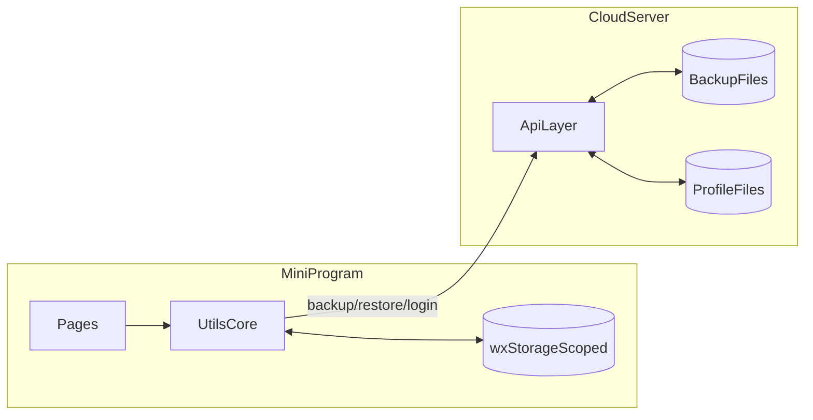
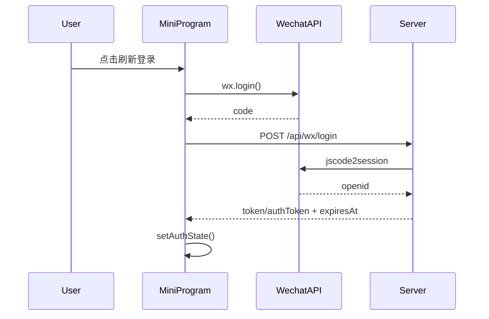
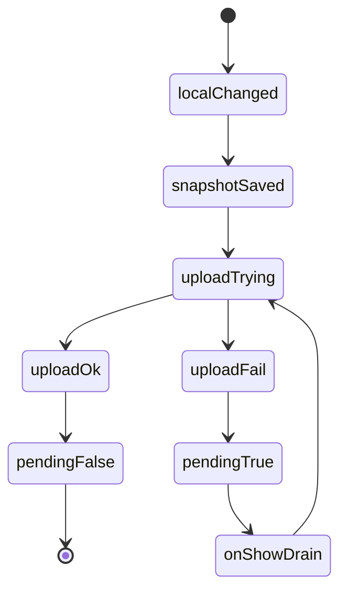
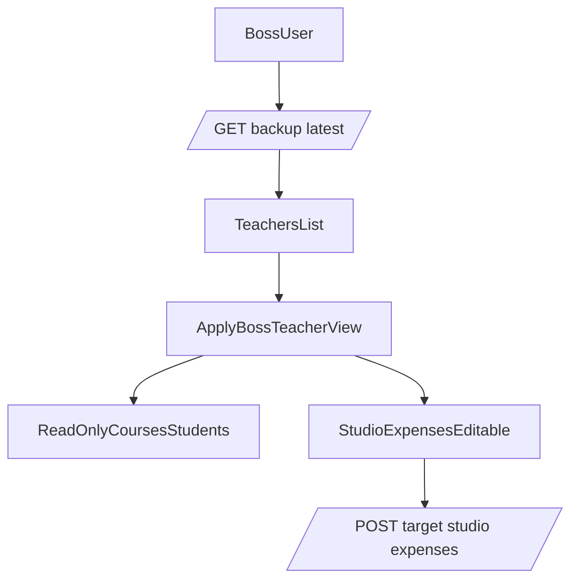
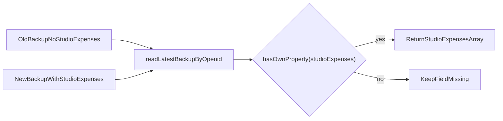
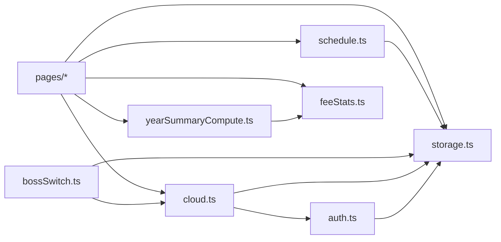
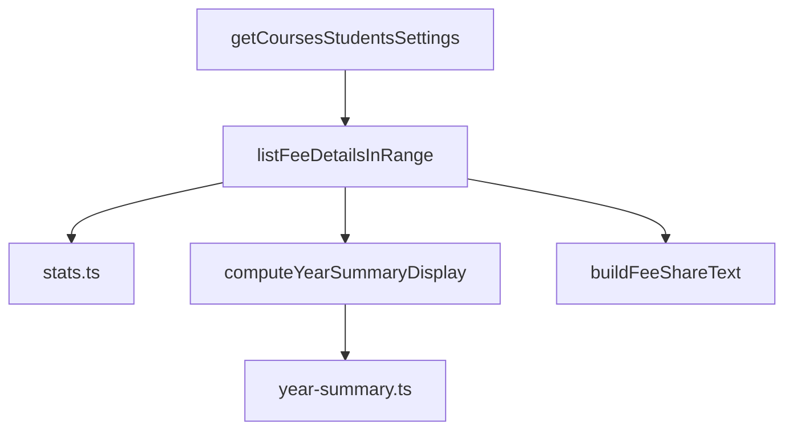
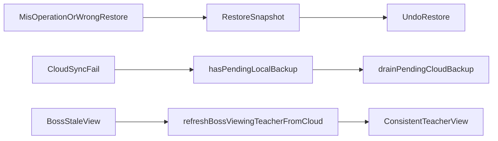

# 钟于钢琴工作室 · 架构白皮书（根 README）

> 本文档是项目总入口：完整说明项目架构、设计理念、关键数据流、风险控制与演进路线。  
> 服务端部署与接口细节详见 [`server/README.md`](server/README.md)。

---

## 目录

1. [项目定位与问题定义](#1-项目定位与问题定义)
2. [总体架构（Local-first 双轨）](#2-总体架构local-first-双轨)
3. [核心流程时序（登录、备份、老板查看）](#3-核心流程时序登录备份老板查看)
4. [模块分层与依赖地图](#4-模块分层与依赖地图)
5. [设计理念与工程取舍](#5-设计理念与工程取舍)
6. [风险控制与可恢复机制](#6-风险控制与可恢复机制)
7. [项目演进里程碑与未来路线](#7-项目演进里程碑与未来路线)
8. [开发与排障导航](#8-开发与排障导航)
9. [本地开发与发布](#9-本地开发与发布)

---

## 1. 项目定位与问题定义

本项目是面向钢琴工作室的微信小程序，核心不是“做一个日历”，而是解决三类真实经营问题：

- **排课效率**：老师在弱网/碎片时间也能快速完成排课、改课、复制、顺延。
- **结算一致性**：课时费、分成、年度汇总、工作室支出口径要前后一致、可复核。
- **多角色治理**：老板可跨老师查看经营快照，但权限边界明确，不误改老师课表。

对应仓库主模块：

- 前端业务：[`miniprogram/pages`](miniprogram/pages)
- 前端核心能力：[`miniprogram/utils`](miniprogram/utils)
- 服务端（可选）：[`server/index.js`](server/index.js)

---

## 2. 总体架构（Local-first 双轨）

### 2.1 架构总览图（图 1/8）

### 2.2 设计含义

- **本地权威**：排课写入先落本地 `storage`，用户体验不依赖实时网络。
- **云端快照**：服务端保存 append-only 备份文件，负责跨设备恢复与老板聚合读取。
- **职责分离**：业务计算主要在前端纯函数完成，服务端聚焦鉴权、落盘、聚合。

---

## 3. 核心流程时序（登录、备份、老板查看）

### 3.1 登录与 token 链路（图 2/8）

关键代码：

- [`miniprogram/utils/auth.ts`](miniprogram/utils/auth.ts)
- [`miniprogram/pages/settings/settings.ts`](miniprogram/pages/settings/settings.ts)
- [`server/index.js`](server/index.js)

### 3.2 备份与补偿状态机（图 3/8）

关键代码：

- [`miniprogram/utils/cloud.ts`](miniprogram/utils/cloud.ts)
- [`miniprogram/app.ts`](miniprogram/app.ts)

### 3.3 老板视图与权限边界（图 4/8）

关键代码：

- [`miniprogram/utils/bossSwitch.ts`](miniprogram/utils/bossSwitch.ts)
- [`miniprogram/pages/boss/boss-teachers/boss-teachers.ts`](miniprogram/pages/boss/boss-teachers/boss-teachers.ts)
- [`server/index.js`](server/index.js)

### 3.4 支出字段兼容语义（图 5/8）

这张图对应的策略是：**缺键不等于空数组**，避免旧备份语义被错误覆盖。

---

## 4. 模块分层与依赖地图

### 4.1 前端分层

- **页面层**：`index/week/day/course-edit/stats/year-summary/settings/...`
- **业务能力层（utils）**：
  - 存储：`storage.ts`
  - 鉴权：`auth.ts`
  - 云同步：`cloud.ts`
  - 老板切换：`bossSwitch.ts`
  - 排课算法：`schedule.ts`
  - 统计计算：`feeStats.ts` + `yearSummaryCompute.ts`
- **类型层**：`types/index.ts`

### 4.2 依赖关系图（图 6/8）

### 4.3 统计同源口径图（图 7/8）

含义：统计页、年度汇总、分享文案共享同一计算核心，避免口径分叉。

---

## 5. 设计理念与工程取舍

### 5.1 Local-first：先保证老师“能用”，再谈同步

- 老师排课是高频操作，网络不是随时稳定，因此本地写入优先。
- 云端备份是“保护资产”和“跨设备恢复”，不是实时写库。
- 实际收益：弱网不阻断业务，减少“保存失败导致停摆”。

### 5.2 兼容优先：让存量版本可继续使用

- `token/authToken` 双字段兼容。
- `expiresAt=0` 和正数时间戳都可解释。
- `studioExpenses` 采用缺键兼容语义，避免旧备份被误判。
- URL 规范化兼容反向代理与历史资源地址。

### 5.3 权限最小化：老板可治理，不可越权

- 老板聚合读取全员 latest。
- 老板代看他人时，课程/学生默认只读。
- 仅工作室支出支持专用接口写入目标老师快照。

### 5.4 算法同源：保证“显示、分享、汇总”一致

- 费用计算统一在 `feeStats`。
- 年度汇总统一在 `yearSummaryCompute`。
- 金额每步 `round2`，降低浮点累计误差。

---

## 6. 风险控制与可恢复机制

### 6.1 风险闭环图（图 8/8）

### 6.2 关键风险与对策

- **误覆盖风险**：刷新登录强制二选一（上传本地 / 恢复云端）。
- **同步失败风险**：pending 标记 + onShow 补偿重试。
- **并发续登风险**：单飞 token 刷新，避免互相覆盖状态。
- **老板视图陈旧风险**：节流刷新 + 下拉强制刷新。
- **口径漂移风险**：统计与汇总核心函数复用。

---

## 7. 项目演进里程碑与未来路线

### 7.1 已完成里程碑

- V1：本地排课闭环（课程/学生/设置）+ 冲突检测与顺延。
- V2：登录与云备份（append-only）。
- V3：老板模式（聚合查看、切换老师）。
- V4：工作室支出独立治理 + 老板代写目标支出。
- V5：登录冲突保护（手动二选一）+ 上传前快照回滚。
- V6：年度汇总、分享增强、时长自定义与按比例计费。

### 7.2 未来路线（非破坏式升级）

- **性能**：老板聚合从目录扫描升级索引/分页。
- **存储**：可平滑引入对象存储与增量同步。
- **安全**：更短期 token、刷新机制、可选端到端加密备份。
- **工程**：服务端从单文件渐进拆分，不破坏 API 契约。

---

## 8. 开发与排障导航

### 8.1 关键函数入口

- 登录与同步：
  - [`miniprogram/utils/auth.ts`](miniprogram/utils/auth.ts) `loginWithServer()`
  - [`miniprogram/utils/cloud.ts`](miniprogram/utils/cloud.ts) `backupCurrentUserToCloud()`
  - [`miniprogram/pages/settings/settings.ts`](miniprogram/pages/settings/settings.ts) `onLoginForBackup()`
- 老板模式：
  - [`miniprogram/utils/bossSwitch.ts`](miniprogram/utils/bossSwitch.ts) `applyBossTeacherView()`
  - [`miniprogram/pages/boss/boss-cert/boss-cert.ts`](miniprogram/pages/boss/boss-cert/boss-cert.ts) `performExitBossAuth()`
- 排课与统计：
  - [`miniprogram/utils/schedule.ts`](miniprogram/utils/schedule.ts) `autoShiftAfterUpdate()`
  - [`miniprogram/utils/feeStats.ts`](miniprogram/utils/feeStats.ts) `listFeeDetailsInRange()`
  - [`miniprogram/utils/yearSummaryCompute.ts`](miniprogram/utils/yearSummaryCompute.ts) `computeYearSummaryDisplay()`
- 服务端：
  - [`server/index.js`](server/index.js) `verifyAuthToken()`, `readLatestBackupByOpenid()`

### 8.2 常见排障顺序

1. 老师本地有数据但老板看不到：先查是否有新备份文件落盘。  
2. 备份失败：检查 token 是否有效，再看 pending 是否被 drain。  
3. 登录后数据异常：确认选择的是“上传本地”还是“恢复云端”。  
4. 年度数据不一致：核对是否共用 `feeStats/yearSummaryCompute` 路径。

---

## 9. 本地开发与发布

1. 用微信开发者工具打开项目，指定 `miniprogram` 为小程序根目录。  
2. 服务端部署与环境变量见 [`server/README.md`](server/README.md)。  
3. 配置合法域名（request/downloadFile）后进行联调。  
4. 发布前建议完成三类检查：
   - 登录与备份链路
   - 老板切换与只读边界
   - 统计与年度汇总口径一致性

---

## 附：仓库主路径

- 前端：[`miniprogram`](miniprogram)
- 服务端：[`server`](server)
- 类型声明：[`typings`](typings)

---

*本 README 随代码持续演进；如文档与实现冲突，以代码行为为准并及时回填文档。*
